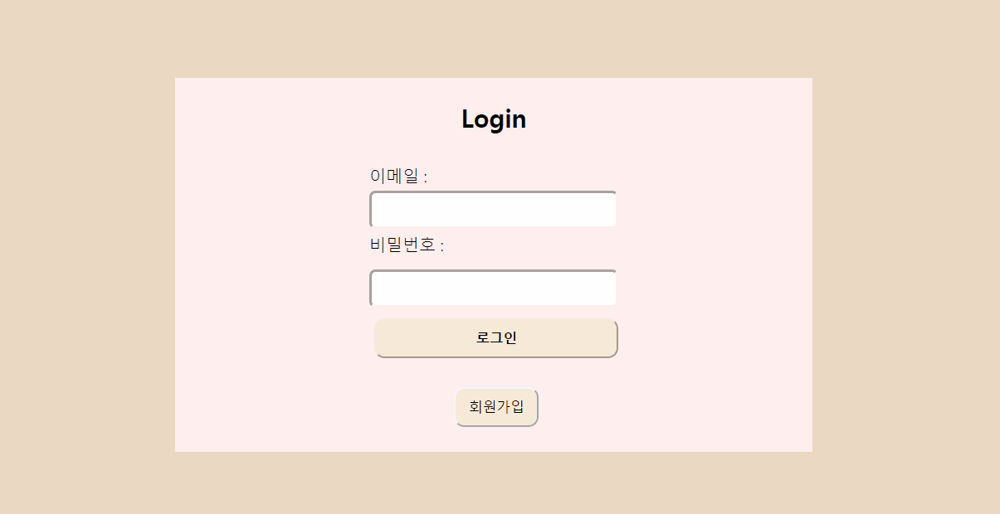
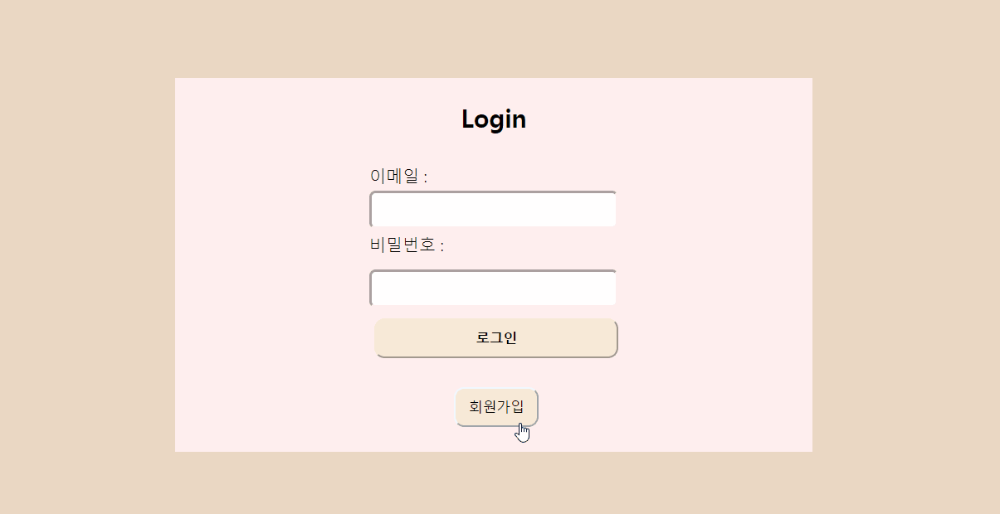
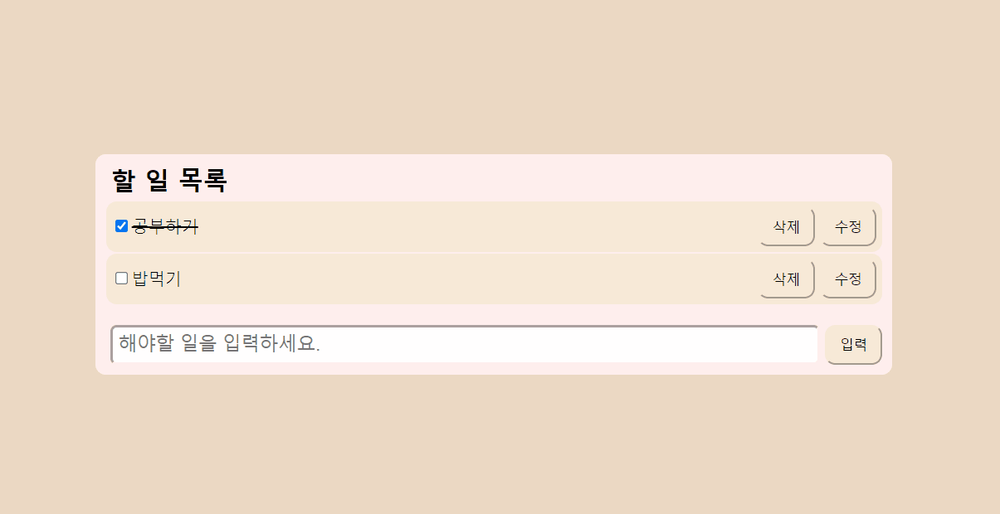

# 원티드 프리온보딩 프론트엔드 - 선발 과제

## Skill

- React
- Styled-components
- react-router-dom

## 기능 

### :: 1. 로그인 / 회원가입





- 로그인은 `/`, 회원가입은 `signup` 별도의 경로로 분리하여 작업했습니다.

- 이메일과 비밀번호 입력시, 각 유효성에 대한 실시간 안내 문구를 함께 렌더링합니다.
- 이메일과 비밀번호 조건이 만족되었을 때, 버튼이 활성화됩니다.
- 로그인 및 회원가입이 성공하면 `/todo` 경로로 이동합니다. 
- accessToken이 있는 경우, `/todo`로 리다이렉트 되고, 없을 때 `/todo` 접근 시, `/`로 리다이렉트 됩니다.

### :: 2. 투두 리스트

### 

- `/todo` 경로로 최초 진입 시, accessToken을 통해 기존 todo list를 받아 렌더링해줍니다.
- 유저는 체크박스를  통해 완료 표시를 할 수 있으며, 수정 버튼을 통해 실시간 수정 및 투두 리스트에 수정 사항이 반영됩니다.
- 삭제 버튼을 통하여 해당 내역을 삭제할 수 있습니다. 


## 실행 방법

```bash
npm i 

npm start
```


## 보완해야할 부분 

- 로그인, 회원가입의 경우, 커스텀 훅을 통해 공통된 메서드들을 재사용할 수 있도록 보완할 예정입니다. 
